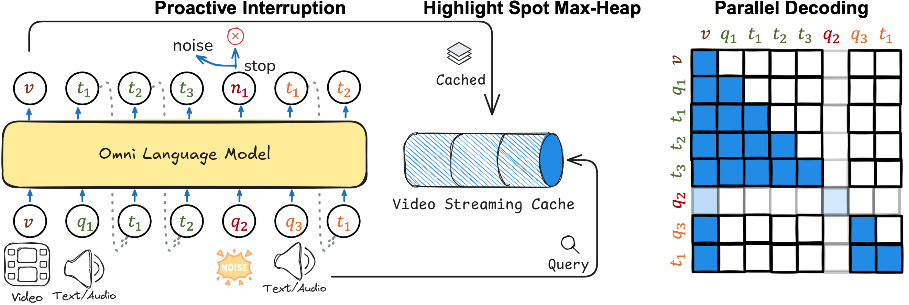

<h1 align="center">Open GPT-4o</h1>
<p align="center">
    <!-- <a href="https://arxiv.org/abs/xxxx.xxxxx">
            
    </a>
    <br> -->
    <a href="https://huggingface.co/ColorfulAI/OpenGPT4o-7B-Qwen2">
        
    </a>

</p>


<!--  -->

<!-- > [!IMPORTANT]
>  -->

## Updates


- `2025` **First Release [Open-GPT-4o](https://github.com/patrick-tssn/Open-GPT-4o)**. a fully open-source implementation of a GPT-4o-like speech-to-speech video understanding model.

**Table of Contents**


- [Introduction](#introduction)
- [Training](#training)
  - [Installation](#installation)
  - [Data Preparation](#data-preparation)
  - [Backbone Preparation](#pretrained-backbone-preparation)
  - [Start Training](#start-training)
- [Usage](#usage)
- [Roadmap](#roadmap)
- [Acknowledgement](#acknowledgement)
- [Citation](#citation)


## Introduction


## Training

### Installation

This codebase is tested on CUDA 11.8 and A800-80G.

```bash
conda create -n open_gpt4o python=3.10 -y && conda activate open_gpt4o
pip install torch==2.5.0 torchvision==0.20.0 torchaudio==2.5.0 --index-url https://download.pytorch.org/whl/cu118
pip install -e ".[train]"
pip install packaging &&  pip install ninja && pip install flash-attn==2.6.3 --no-build-isolation --no-cache-dir
pip install -r requirements.txt
```

Additionally, Install [fairseq](https://github.com/facebookresearch/fairseq) for speech units process


### Data Preparation

Data download:
- Download [LLaVA-NeXT-Data](https://huggingface.co/datasets/lmms-lab/LLaVA-NeXT-Data) for visual instruction tuning 
- Download [VoiceAssistant-400K](https://huggingface.co/datasets/gpt-omni/VoiceAssistant-400K) for speech instruction tuning. 
You can sample a portion of these datasets based on your computational resources. 

Data preprocess:
- Install [CosyVoice](https://github.com/FunAudioLLM/CosyVoice) or [ChatTTS](https://github.com/2noise/ChatTTS), for speech synthesis and test speech generation. If you are interested in the process of the speech instruction synthesis, you can refer to the scripts in `preprocess/tts`
- Download [mHuBERT](https://dl.fbaipublicfiles.com/hubert/mhubert_base_vp_en_es_fr_it3.pt) and [K-means Model](https://dl.fbaipublicfiles.com/hubert/mhubert_base_vp_en_es_fr_it3_L11_km1000.bin) to `checkpoints/quantizer` for speech units generation. You can refer to the scripts in `preprocess/quantize` for the speech unit generation process.


*optional:* In addition, to assist with visual-audio instruction tuning, we convert user queries from [LLaVA-NeXT](https://github.com/LLaVA-VL/LLaVA-NeXT) into audio using [CosyVoice](https://github.com/FunAudioLLM/CosyVoice), you can download it from [LLaVA-NeXT-Audio](https://huggingface.co/datasets/ColorfulAI/LLaVA-NeXT-Audio).

Data sample

```json
    {
        "id": "000000240632",
        "image": "000000240632.jpg",
        "conversations": [
            {
                "from": "human",
                "value": "<image>\n"
            },
            {
                "from": "human",
                "value": "<speech>\n"
            },
            {
                "from": "gpt",
                "value": "Hi, I am Open-GPT-4o, the video show ...",
                "tgt_units": [497, 300, 63, ...]

            },
        ],
        "speech": [
            "000000240632_0.wav",
            "000000240632_1.wav"
        ]
    },
```

The final data is organized in the following format:

```
open_gpt4o/inputs    
    ├── images/ # images
      └── llava-next/
        ├── ...
        └── xxxx.jpg
    ├── speech/
      ├── voiceassistant/
        ├── ...
        └── xxxx.wav
      └── interinst/
        ├── ...
        └── xxxx.wav
    └── texts/
      ├── llava_next_audio.json
      ├── llava_next_audio_units.json
      ├── voiceassistant.json
      └── voiceassistant_units.json
```


### Pretrained Backbone Preparation

Download the pretrained large video language model weights [LongVA-7B](https://huggingface.co/lmms-lab/LongVA-7B), the pretrained audio encoder weights [Whisper](https://github.com/openai/whisper), and the [HiFi-GAN vocoder](https://dl.fbaipublicfiles.com/fairseq/speech_to_speech/vocoder/code_hifigan/mhubert_vp_en_es_fr_it3_400k_layer11_km1000_lj/g_00500000) with [config](https://dl.fbaipublicfiles.com/fairseq/speech_to_speech/vocoder/code_hifigan/mhubert_vp_en_es_fr_it3_400k_layer11_km1000_lj/config.json), and place them in the `open_gpt4o/checkpoints` directory.

```
open_gpt4o/checkpoints    
    ├── Qwen2-7B-Instruct
    ├── whisper/large-v3.pt
    └── vocoder
        ├── config.json
        └── g_00500000
```


### Start Training

Our training logic is takes three steps:

**1. Visual instruction tuning**

If you wish to use other LLMs or instruction tuning data, feel free to follow the [LLaVA-NeXT](https://github.com/LLaVA-VL/LLaVA-NeXT) pipeline. Here, we provide a pipeline to do visual instruction tuning on [Qwen2-7B-Instruct](https://huggingface.co/Qwen/Qwen2-7B-Instruct) or [Llama-3.1-8B](https://huggingface.co/meta-llama/Llama-3.1-8B-Instruct/tree/main) using the datasets [blip_laion_cc_sbu_558k](https://huggingface.co/datasets/liuhaotian/LLaVA-Pretrain), [LLaVA-NeXT-Data](https://huggingface.co/datasets/lmms-lab/LLaVA-NeXT-Data), and [ShareGPTVideo](https://huggingface.co/datasets/ShareGPTVideo/train_video_and_instruction). Feel free to adapt it to other models.

```bash
cd open_gpt4o
bash scripts/lvlm_pretrain.sh
bash scripts/lvlm_finetune.sh
bash scripts/lvlm_dpo.sh
```

Alternatively, you can directly use an off-the-shelf LLaVA-like model such as [LongVA-7B](https://huggingface.co/lmms-lab/LongVA-7B).

**2. Audio/Speech instruction tuning**


```bash
bash scripts/finetune_voiceassistant.sh
```

To assist those with limited computational resources, we also provide an off-the-shelf checkpoint. Check it out at [](https://huggingface.co/ColorfulAI/LongVA-7B-Qwen2-VoiceAssistant)


*We can combine step 1 and step 2 to perform visual-audio instruction tuning simultaneously:*

To enhance the model's visual-audio understanding capabilities, we offer a script to fine-tune it using the [](https://huggingface.co/datasets/ColorfulAI/LLaVA-NeXT-Audio) dataset. This aims to improve visual-audio alignment performance. (This process takes ~140 hours on 4 A800 GPU)

> NOTE: We find that this process is more prone to collapse than audio instruction tuning alone, so we provide it just for further study.

```bash
bash scripts/finetune_llavanextaudio.sh
```

For those with limited computational resources, we also provide a ready-to-use checkpoint (17500 step). You can access it here [](https://huggingface.co/ColorfulAI/LongVA-7B-Qwen2-Audio)

Try the visual-audio base model through `python -m local_demo.baseline_audio_cli --video_path local_demo/assets/water.mp4 --question_audio "local_demo/wav/water.mp4.wav"`


**3. Speech generator tuning**

For speech generation, we adopt the tuning strategy from [LLaMA-Omni](https://github.com/ictnlp/LLaMA-Omni), utilizing the connectionist temporal classification (CTC) loss to align the hidden states of the LLM with discrete speech units extracted by the HuBERT and K-means models.

```bash
bash scritps/finetune_opengpt4o.sh
```

*TRIAL: We can streamline these three steps into a single end-to-end process by creating visual-audio-speech data, then running `scripts/finetune_opengpt4o.sh`.*

## Usage

```python
import os
import json
from PIL import Image
import numpy as np
import torchaudio
import torch
from decord import VideoReader, cpu
import whisper
import soundfile as sf
# fix seed
torch.manual_seed(0)

from fairseq import utils as fairseq_utils
from fairseq.models.text_to_speech.vocoder import CodeHiFiGANVocoder

from open_gpt4o.model.builder import load_pretrained_model
from open_gpt4o.mm_utils import tokenizer_image_speech_tokens, process_images, ctc_postprocess
from open_gpt4o.constants import IMAGE_TOKEN_INDEX, SPEECH_TOKEN_INDEX

import warnings
warnings.filterwarnings("ignore")

# config OpenGPT4o
model_path = "checkpoints/OpenGPT4o-7B-Qwen2"
video_path = "local_demo/assets/water.mp4"
audio_path = "local_demo/wav/infer.wav"
max_frames_num = 16 # you can change this to several thousands so long you GPU memory can handle it :)
gen_kwargs = {"do_sample": True, "temperature": 0.5, "top_p": None, "num_beams": 1, "use_cache": True, "max_new_tokens": 1024}
tokenizer, model, image_processor, _ = load_pretrained_model(model_path, None, "llava_s2s_qwen", device_map="cuda:0")

# config vocoder
with open("checkpoints/vocoder/config.json") as f:
    vocoder_cfg = json.load(f)
vocoder = CodeHiFiGANVocoder("checkpoints/vocoder/g_00500000", vocoder_cfg).cuda()

# query input
query = "Give a detailed caption of the video as if I am blind."
query = None # comment this to use ChatTTS to convert the query to audio

#video input
prompt = "<|im_start|>system\nYou are a helpful assistant.<|im_end|>\n<|im_start|>user\n<image><|im_end|>\n<|im_start|>user\n<speech>\n<|im_end|>\n<|im_start|>assistant\n"
input_ids = tokenizer_image_speech_tokens(prompt, tokenizer, IMAGE_TOKEN_INDEX, SPEECH_TOKEN_INDEX, return_tensors="pt").unsqueeze(0).to(model.device)
vr = VideoReader(video_path, ctx=cpu(0))
total_frame_num = len(vr)
uniform_sampled_frames = np.linspace(0, total_frame_num - 1, max_frames_num, dtype=int)
frame_idx = uniform_sampled_frames.tolist()
frames = vr.get_batch(frame_idx).asnumpy()
video_tensor = image_processor.preprocess(frames, return_tensors="pt")["pixel_values"].to(model.device, dtype=torch.float16)

#audio input
# process speech for input question
if query is not None:
    import ChatTTS
    chat = ChatTTS.Chat()
    chat.load(source='local', compile=True)
    audio_path = "./local_demo/wav/" + "infer.wav"
    if os.path.exists(audio_path): os.remove(audio_path) # refresh
    if not os.path.exists(audio_path):
        wav = chat.infer(query)
        try:
            torchaudio.save(audio_path, torch.from_numpy(wav).unsqueeze(0), 24000)
        except:
            torchaudio.save(audio_path, torch.from_numpy(wav), 24000)
    print(f"Human: {query}")
    
else:
    print("Human: <audio>")
    
speech = whisper.load_audio(audio_path)
speech = whisper.pad_or_trim(speech)
speech = whisper.log_mel_spectrogram(speech, n_mels=128).permute(1, 0).to(device=model.device, dtype=torch.float16)
speech_length = torch.LongTensor([speech.shape[0]]).to(model.device)

with torch.inference_mode():
    output_ids, output_units = model.generate(input_ids, images=[video_tensor],  modalities=["video"], speeches=speech.unsqueeze(0), speech_lengths=speech_length, **gen_kwargs)
outputs = tokenizer.batch_decode(output_ids, skip_special_tokens=True)[0].strip()
print(f"Agent: {outputs}")

output_units = ctc_postprocess(output_units, blank=model.config.unit_vocab_size)
output_units = [(list(map(int, output_units.strip().split())))]
print(f"Units: {output_units}")
x = {"code": torch.LongTensor(output_units[0]).view(1,-1)}
x = fairseq_utils.move_to_cuda(x)
wav = vocoder(x, True)
output_file_path = "local_demo/wav/output.wav"
sf.write(
    output_file_path,
    wav.detach().cpu().numpy(),
    16000
)
print(f"The generated wav saved to {output_file_path}")
```


## Roadmap

- [ ] To collect high quanlity visual-audio-speech data
- [ ] To support streaming
- [ ] To support multilingual
- [ ] To support more voice codec

## Acknowledgement

- visual instruction tuning
    - [LLaVA-NeXT](https://github.com/LLaVA-VL/LLaVA-NeXT)
    - [LongVA](https://github.com/EvolvingLMMs-Lab/LongVA)
- audio/speech instruction tuning 
    - [LLaMA-Omni](https://github.com/ictnlp/LLaMA-Omni)
- speech generator tuning
    - [LLaMA-Omni](https://github.com/ictnlp/LLaMA-Omni)

## Citation

If you find our work helpful, please consider citing it.

```bibtex
@article{omnimmi,
    title={OmniMMI: A Comprehensive Multi-modal Interaction Benchmark in Streaming Video Contexts},
    author={Wang, Yuxuan and Wang, Yueqian and Chen, Bo and Wu, Tong and Zhao, Dongyan and Zheng, Zilong},
    journal={arxiv},
    year={2025}
}
```
